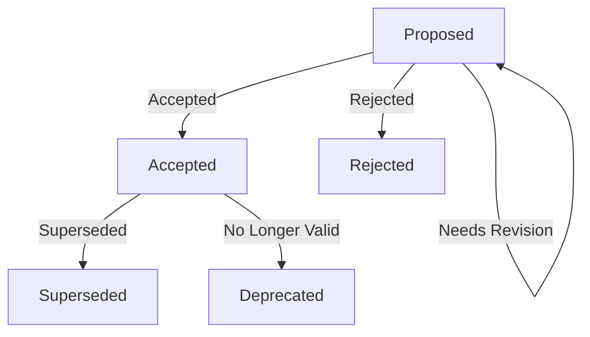

---
runme:
  id: 01JFHKRP4XQMZ2V8NWJY5KTHG6
  version: v3
---

# D0000 - Decision Log Format and Process

## Context and problem statement

We need a standardized format for recording architectural and technical decisions that is clear, maintainable, and useful for both current and future team members.

### Requirements

#### Must Have

- Clear structure for decision documentation
- Traceable decision history
- Context preservation
- Easy to write and review
- Searchable content

#### Nice to Have

- Template automation
- Version control friendly
- Links to related decisions
- Status tracking
- Impact assessment

## Decision outcomes

### Proposal and Decision Process

1. **Proposal Creation**

   - Create a new branch: `decision/DXXXX-description`
   - Use template to create decision document
   - Submit PR containing ONLY the decision document
   - Status should be "Proposed"

2. **Discussion Phase**

   - All discussion must happen in PR comments
   - Changes requested via PR review
   - No other files should be modified
   - Discussion is preserved in PR history

3. **Decision Making**

   - Project owner (@pfouilloux) has final veto power
   - Decisions can be:
      - Accepted: Merged as-is
      - Rejected: PR closed
      - Revised: Changes requested
      - Deferred: PR kept open for future

4. **Implementation**

   - After acceptance, create implementation PR
   - Reference decision in implementation PR
   - Implementation may span multiple PRs

### Status Workflow



### Format: Modified MADR (Markdown Any Decision Records)

We will use a modified version of the MADR format with additional sections for implementation notes and risks:

```markdown
---
runme:
  id: [ULID]
  version: v3
---

# [Title]

## Context and problem statement

[Description of the issue and why a decision is needed]

### Requirements

#### Must Have
- [Critical requirements]

#### Nice to Have
- [Optional requirements]

## Decision outcomes

### [Component/Choice]

[Description of the selected solution]

### Implementation Strategy

[How the solution will be implemented]

## Risks

[Known risks and challenges]

## Mitigation Strategies

[How risks will be addressed]

## Other options considered

### [Option 1]

##### Pros
- [Benefits]

##### Cons
- [Drawbacks]

## Implementation Notes

[Additional technical details and considerations]
```

### Key Format Elements

1. **Frontmatter**

   - ULID for unique identification
   - Version tracking
   - Future extensibility

2. **Context Section**

   - Problem statement
   - Requirements categorization
   - Clear scope definition

3. **Decision Section**

   - Selected solution
   - Implementation strategy
   - Practical considerations

4. **Risk Management**

   - Identified risks
   - Mitigation strategies
   - Ongoing concerns

5. **Alternatives**

   - Other options considered
   - Pros and cons analysis
   - Why not chosen

### File Naming Convention

Format: `D[XXXX]-[KebabCaseTitle].md`
Example: `D0001-TechStack.md`

- Sequential numbering
- Descriptive title
- Markdown extension

## Implementation Strategy

1. **Template Management**

   - Store template in `.github/templates`
   - Provide creation script
   - Include example content

2. **PR Automation**

   - PR template for decisions
   - Status check for single file
   - Format validation
   - Automated labeling

3. **Process Enforcement**

   - Branch protection rules
   - Required reviewers
   - Status checks
   - File path restrictions

## Risks

- Format Drift: Different authors may interpret format differently
- Over-Documentation: Too much detail in wrong places
- Under-Documentation: Missing critical context
- Template Rigidity: Format may not fit all decisions
- Version Control: Conflicts in collaborative editing

## Mitigation Strategies

- Provide clear examples
- Regular format reviews
- Template automation
- Style guide integration
- Collaborative review process

## Other options considered

### [ADR (Architecture Decision Records)](https://github.com/joelparkerhenderson/architecture_decision_record)

#### Pros

- Simple format
- Wide adoption
- Good documentation
- Many examples
- Tool support

#### Cons

- Less structured
- Missing risk section
- Limited metadata
- No requirements section
- Basic template

### [Nygard ADR Format](https://cognitect.com/blog/2011/11/15/documenting-architecture-decisions)

#### Pros

- Original ADR format
- Proven approach
- Minimal structure
- Easy to write
- Focus on context

#### Cons

- Too minimal
- No risk section
- Limited metadata
- No implementation details
- No requirements section

### [Y-Statements](https://medium.com/olzzio/y-statements-10eb07b5a177)

#### Pros

- Very structured
- Clear decision capture
- Good for databases
- Consistent format
- Easy to query

#### Cons

- Too rigid
- Complex to write
- Limited context
- No alternatives section
- Not markdown friendly

## Implementation Notes

### PR Template

```markdown
## Decision Proposal

**Decision ID:** DXXXX
**Title:** [Title]

### Checklist
- [ ] Only contains decision document
- [ ] Follows template format
- [ ] Includes requirements
- [ ] Documents alternatives
- [ ] Considers risks
- [ ] Provides implementation strategy

### Additional Context
[Any extra information to support the decision]
```

### Branch Protection Rules

```yaml
branches:
  main:
    protection:
      required_status_checks:
        strict: true
        contexts: ['decision-format']
      required_reviews: 1
      restrictions:
        users: ['pfouilloux']
```

### Decision Submission Script

```bash
#!/bin/bash
# Create new decision branch and document
NUMBER=$(printf "%04d" $1)
TITLE=$2
BRANCH="decision/D${NUMBER}-${TITLE}"

git checkout -b "$BRANCH"
./scripts/create-decision.sh "$NUMBER" "$TITLE"
git add "docs/decisions/D${NUMBER}-${TITLE}.md"
git commit -m "Propose: D${NUMBER} ${TITLE}"
git push -u origin "$BRANCH"
```

### Status Tracking

Decisions can have the following statuses in frontmatter:

```yaml
---
runme:
  id: [ULID]
  version: v3
  status: Proposed | Accepted | Rejected | Superseded | Deprecated
  driver: '@username'
---
```

### Version History

Track significant changes in the frontmatter:

```yaml
---
runme:
  id: [ULID]
  version: v3
  status: Proposed
  driver: '@username'
  history:
    - v1: Initial proposal
    - v2: Address review comments
    - v3: Final accepted version
---
```

### Related Decisions

Link related decisions using:

```markdown
Related to:
- [D0001](D0001-TechStack.md) - Supersedes this decision
- [D0002](D0002-Toolkit.md) - Depends on this decision
```

### Automation Tools

1. **Template Generation**

   ```bash
   #!/bin/bash
   ULID=$(ulid)
   NUM=$(printf "%04d" $1)
   TITLE=$2
   sed "s/\[ULID\]/$ULID/g" .github/templates/decision.md > "docs/decisions/D${NUM}-${TITLE}.md"
   ```

2. **Format Validation**

   ```yaml
   decision-logs:
   stage: lint
   script:
      - vale docs/decisions/*.md
      - ./scripts/check-decision-format.sh
   ```
